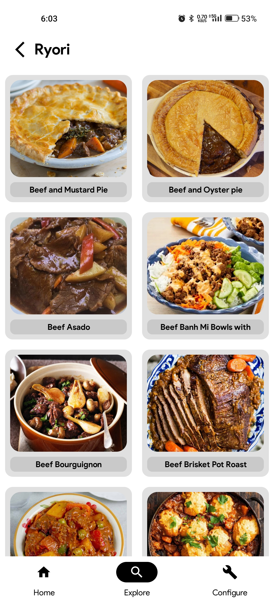
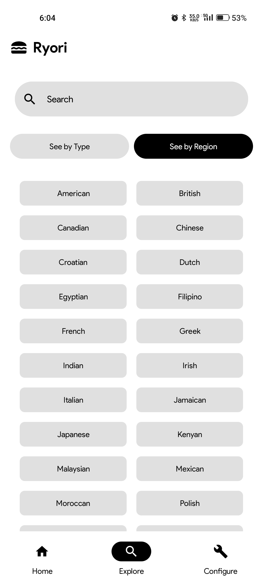
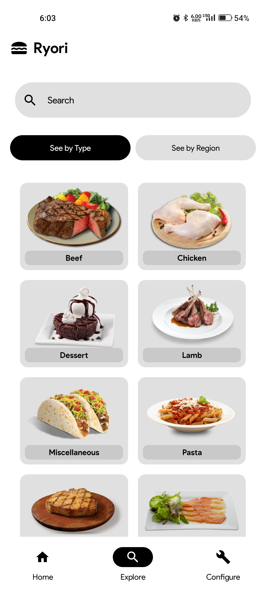
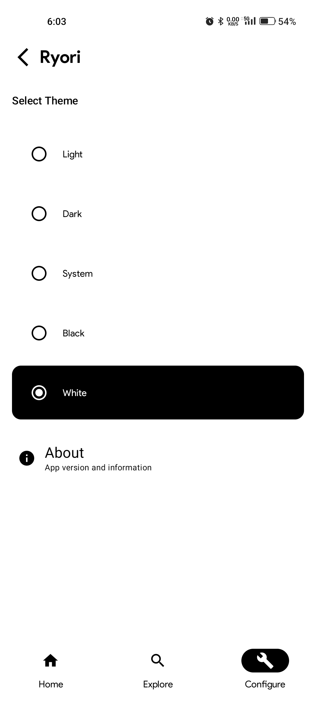
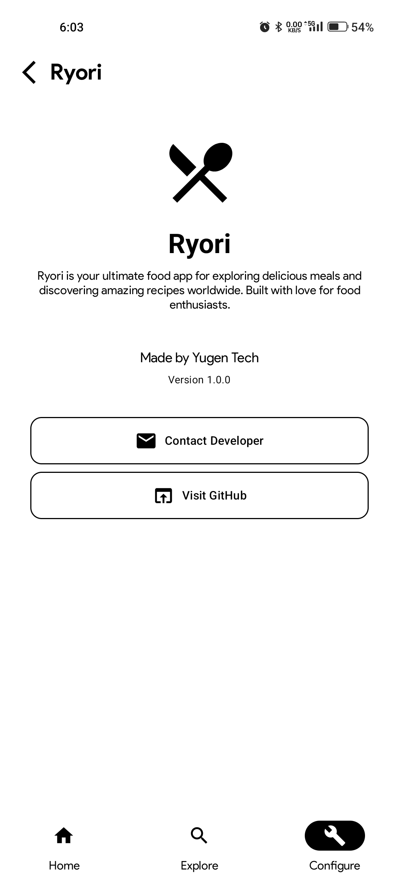

# 🌸 Ryori - Your Personalized Food Companion

Welcome to **Ryori**, a sleek and simple food application designed to make exploring and discovering meals effortless and delightful. Powered by **TheMealDB API**, Ryori serves as your gateway to a world of delicious recipes and meal inspirations.

---

## ✨ Features

- **Suggested Meal**: Get inspired daily with a randomly suggested meal on the home screen.
- **Explore by Category and Area**: Browse meals by categories or regions for a diverse culinary experience.
- **Interactive UI**: Beautiful and minimalistic design using Jetpack Compose.
- **Lightweight & Fast**: Optimized with lazy loading for a smooth browsing experience.

---

## 🎨 UI Highlights

- **Modern Design**: Crafted with Google's **Product Sans** font for a premium feel.
- **Dynamic Layouts**:
  - A visually captivating **Home Screen** showcasing a suggested meal.
  - An **Explore Screen** with categorized browsing and regional delicacies.
- **Seamless Navigation**: Navigate effortlessly with a bottom navigation bar.

---

## 🚀 Technologies Used

- **Language**: Kotlin  
- **UI Framework**: Jetpack Compose  
- **Networking**: Retrofit with Moshi  
- **API**: [TheMealDB](https://www.themealdb.com/)  
- **Architecture**: Minimalist, skipping ViewModels for simplicity.  

---

## 📸 Screenshots

<div align="center">
  




<br/><br/>





</div>

---

## 🛠️ Setup & Installation

1. **Clone the Repository**:
   ```bash
   git clone https://github.com/MohammadAliUstad/Ryori.git
   cd ryori
   ```
2. **Open in Android Studio**: Import the project and sync Gradle.  
3. **Run**: Build and run the app on an emulator or physical device.  

---

## 🌟 Contributing

Contributions are welcome!  
Feel free to fork the repository and submit a pull request for suggestions or improvements.  
 
---

## 📞 Contact

Got feedback or questions? Reach out to me at:  
📧 **Mohammadaliustad@gmail.com**
