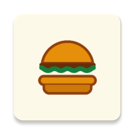
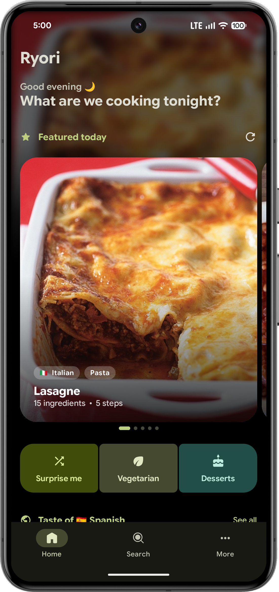
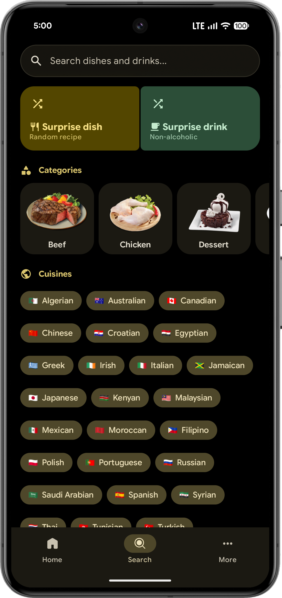
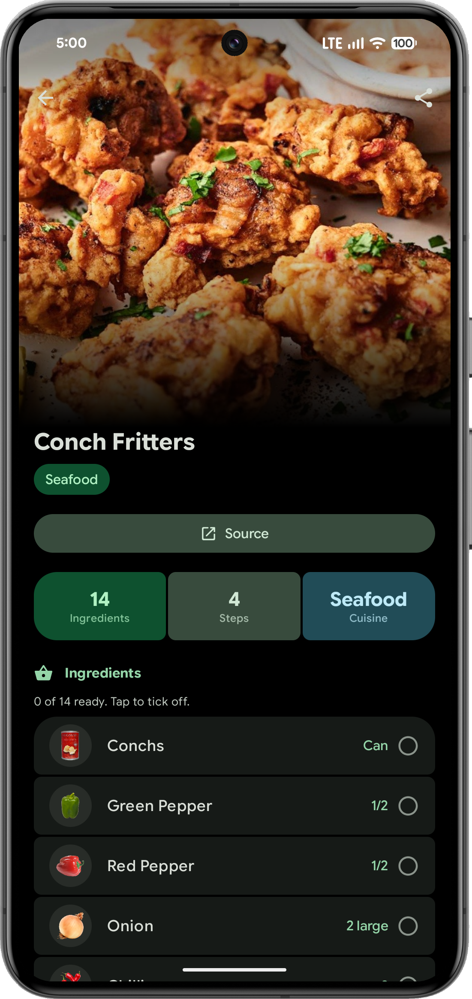
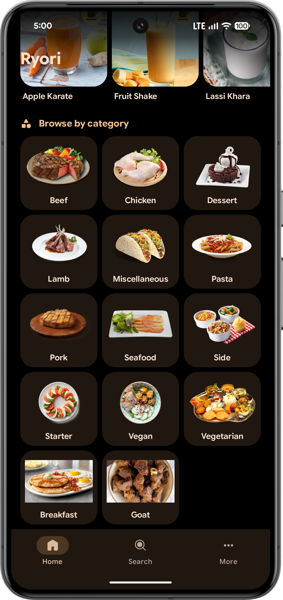
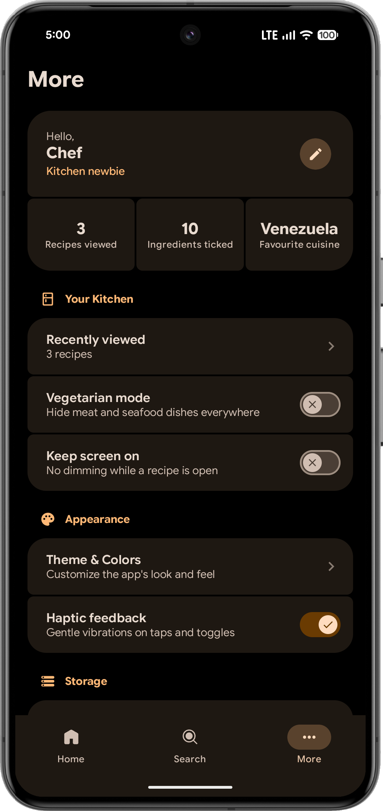
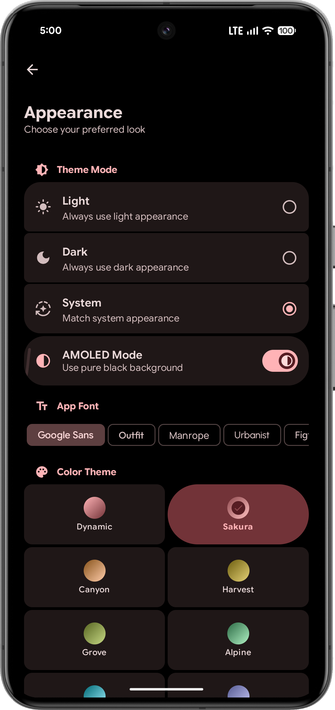

<div align="center">

<table border="0" width="100%">
    <tr>
        <td width="30%" align="center" valign="middle">
            
        </td>
        <td width="70%" valign="middle">
            <h1>Ryori</h1>
            <h3>Your Personal Food Companion</h3>
            <p><i>A calm, beautifully crafted recipe app for discovering meals and mocktails from every kitchen in the world.</i></p>
        </td>
    </tr>
</table>

<br/>

[Report Bug](https://github.com/MohammadAliUstad/Ryori/issues) · [Request Feature](https://github.com/MohammadAliUstad/Ryori/issues) · [Download Latest Release](https://github.com/MohammadAliUstad/Ryori/releases)

</div>

---

## Table of Contents

- [Overview](#overview)
- [Key Features](#-key-features)
- [Screenshots](#-screenshots)
- [Technical Architecture](#technical-architecture)
- [Setup & Installation](#setup--installation)
- [Contributing](#-contributing)
- [Contact & Support](#contact--support)

---

## Overview

Ryori turns the question of *"what should I cook?"* into something to look forward to. Every day it serves up fresh inspiration: a featured carousel, a cuisine and a category of the day, and a **Surprise me** button for when you can't decide. From there you can browse hundreds of recipes by category, cuisine, ingredient or letter, or search for a dish or drink by name.

Recipes are powered by **TheMealDB**, with non-alcoholic drinks from **TheCocktailDB** sitting right alongside the meals. Everything you open is saved on your device, so your favourites load instantly, even without a connection. No account needed.

---

## ✨ Key Features

### A Home That Inspires

- **Featured today:** a carousel of hand-picked recipes over a blurred parallax backdrop. Shuffle for a fresh set at any time.
- **Cuisine and category of the day:** a new spotlight every visit, like *Taste of 🇯🇵 Japanese* or *Pasta favourites*.
- **Something to sip:** a row of mocktails and non-alcoholic drinks.
- **Quick picks:** one tap to **Surprise me**, **Vegetarian** or **Desserts**.
- **Smooth loading:** skeletons the exact size of the content fade into place, so nothing jumps around.

### Explore Every Kitchen

- **Browse by category, cuisine or ingredient**, with a flag for every cuisine and a *Cook With* row of staple ingredients.
- **Drinks & Mocktails:** browse non-alcoholic drinks by type.
- **Browse A–Z:** every recipe, letter by letter.
- **Search:** find dishes and drinks by name as you type, with quick suggestions to get you started.
- **Surprise me:** a random meal or drink, one tap away.

### Cook Along

- **Step-by-step instructions,** cleaned up and split into clear, readable steps.
- **Ingredient checklist:** tick off ingredients as you go, each with its own picture.
- **Watch the video** or open the original source, when a recipe has one.
- **Share** any recipe with a friend.
- **More like this:** related dishes and drinks at the end of every recipe.
- **Keep screen on:** no dimming while you follow a recipe with floury fingers.

### Your Kitchen

- **Chef profile:** set your name and watch your kitchen stats grow: recipes viewed, ingredients ticked and your favourite cuisine.
- **Recently viewed:** every recipe you open is kept, so last night's dinner is always a tap away.
- **Vegetarian mode:** one switch hides meat and seafood across Home, Explore, search and suggestions.

### Works Offline

- **Smart response cache:** recipes, lists and categories are stored on your device and served instantly, refreshing in the background when they go stale.
- **Offline fallback:** when there's no connection, Ryori shows the last saved copy instead of an error.
- **Friendly errors:** clear messages for being offline, slow connections or server trouble, always with a way to try again.
- **Storage control:** see how much is cached and clear it whenever you like.

### Make It Yours

- **8 color themes:** Dynamic (Material You), Twilight, Grove, Canyon, Sakura, Lagoon, Harvest and Alpine.
- **Light, dark and system modes,** plus **AMOLED black**.
- **6 fonts:** Google Sans, Outfit, Manrope, Urbanist, Figtree and Garamond.
- **Gentle haptics** on taps and toggles, which you can switch off.

---

## 📱 Screenshots

<div align="center">

<table width="100%">
  <tr>
    <td align="center" width="33%">
      
      <br/><sub><b>Home</b></sub>
    </td>
    <td align="center" width="33%">
      
      <br/><sub><b>Search</b></sub>
    </td>
    <td align="center" width="33%">
      
      <br/><sub><b>Recipe</b></sub>
    </td>
  </tr>
  <tr>
    <td align="center" width="33%">
      
      <br/><sub><b>Categories</b></sub>
    </td>
    <td align="center" width="33%">
      
      <br/><sub><b>More</b></sub>
    </td>
    <td align="center" width="33%">
      
      <br/><sub><b>Appearance</b></sub>
    </td>
  </tr>
</table>

</div>

---

## Technical Architecture

Ryori follows MVVM with a repository layer, and every network call goes through a local cache.

```text
app/src/main/java/com/yugentech/ryori/
├── api/          Networking: TheMealDB & TheCocktailDB services, response cache,
│                 repositories, error mapping, view models
├── data/         Room database, DataStore settings, kitchen stats & recently viewed
├── di/           Koin modules and the Application class
├── navigation/   Nav host, graphs, bottom bar destinations, transitions
├── theme/        Color schemes, fonts, typography, design tokens, haptics
├── ui/           Compose screens: Home, Explore, recipe lists, recipe details,
│                 More, Appearance, Recently viewed, About, What's There
└── utils/        Shared constants
```

### How the Cache Works

Every request goes through `CachedApi`, backed by Room:

| Data | Kept fresh for |
|---|---|
| Categories, cuisines, ingredients, recipe details | 7 days |
| Filtered lists (by category, cuisine, ingredient, letter) | 1 day |
| Search results | 1 hour |
| Random picks | Always fresh |

A fresh copy is served without touching the network. A stale or missing one is fetched and cached only once it decodes correctly. If the network fails, the last saved copy is served instead, however old.

### Tech Stack

```text
Language:             Kotlin 2.4
UI:                   Jetpack Compose, Material 3 Expressive, Haze (blur), Coil, Lottie
Architecture:         MVVM + Repository pattern
Dependency Injection: Koin
Networking:           Ktor (OkHttp engine) + Kotlinx Serialization
Local Storage:        Room (response cache, stats, recently viewed), DataStore
Navigation:           Navigation Compose
Logging:              Timber
Concurrency:          Kotlin Coroutines & Flow
APIs:                 TheMealDB, TheCocktailDB
Min / Target SDK:     33 / 37
```

---

## Setup & Installation

### Prerequisites

- Android Studio (latest stable recommended)
- JDK 17 or higher
- Android SDK with API 37 installed (the app runs on API 33+)

No API keys are needed: Ryori uses the free public tiers of TheMealDB and TheCocktailDB.

### 1. Clone the repository

```bash
git clone https://github.com/MohammadAliUstad/Ryori.git
cd Ryori
```

### 2. Build & run

1. Open the project in Android Studio and sync Gradle.
2. Select a device or emulator.
3. Click **Run ▶️**.

---

## 🤝 Contributing

Contributions are what make the open source community such an amazing place to learn, inspire, and create. Any contributions you make are **greatly appreciated**.

1. Fork the project
2. Create your feature branch (`git checkout -b feature/AmazingFeature`)
3. Commit your changes (`git commit -m 'Add some AmazingFeature'`)
4. Push to the branch (`git push origin feature/AmazingFeature`)
5. Open a pull request

---

## 🙏 Credits

- Recipes from [TheMealDB](https://www.themealdb.com/) and drinks from [TheCocktailDB](https://www.thecocktaildb.com/)
- Illustrations and doodles by Pablo Stanley
- Animated navigation icons by [Lordicon](https://lordicon.com/)

---

## Contact & Support

If you run into an issue or have an idea for a future update, please open an issue on GitHub or contact the developer directly.

**Developer:** Mohammad Ali Ustad

**Email:** Mohammadaliustad@gmail.com

**Company:** Yugen Tech

<div align="center">

### Show Your Support

If you find this project helpful, please consider giving it a ⭐!

</div>

---

<div align="center">
<sub>Built with ❤️ by Yugen Tech</sub>
</div>
